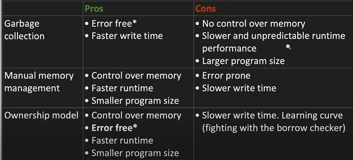

#### Tutorials

**Book**: https://doc.rust-lang.org/stable/book/  
**Videos**: https://youtube.com/playlist?list=PLai5B987bZ9CoVR-QEIN9foz4QCJ0H2Y8&feature=shared


##### Project Setup

* Compile single file

    `rustc <file_name>`

* Cargo project setup:

    Create a library: `cargo new <project_name>`
    Build: `cargo build`
    Run a program: `cargo run`
    Check for issues: `cargo check`

##### Programming

* Create variables
    `let var_name  = ...`

    Variables are immutable by default, so add `mut` for make them mutable
    `let mut var_name = ...`

* To use the other libaries 
    `use <library>::<...>` -> equivalent to `import ` in python or `#include ` C++

    for example `use std::io` for IO

* Handling Invalid Input
    * ```rust 
        <...statement...> => {
            ok(...) => ...,
            Err(...) => {
                ... Hanle ...
            }
        }
        ```
    For example, take only numbers as input
    
    ```rust 
        
        let mut input_num = String::new();
        io::stdin()
            .read_line(&mut input_num)
            .expect("Failed to read line");

        let input_num: u32 = match input_num.trim().parse() {
            Ok(num) => num,
            Err(_) => {
                println!("Please enter a number!");
                continue;
            }
        };
    ```
* Ownership

* **Ownership**: Ensures memory safety in Rust, with rules checked at compile time. 



* **Stack and Heap**: Stack is fast and for fixed-size data; Heap is for dynamic-sized data.
* **Scope**: Determines the validity of a variable; it starts from declaration to the end of the block.
* **String Type**: Allows mutable, growable pieces of text; stored on the heap.
* **Memory Allocation**: Rust manages memory automatically using the drop function when a variable goes out of scope.
* **Data Interaction**: Assignment of a variable is a move (shallow copy), original variable is invalidated unless clone is used or the type implements the Copy trait.
* **Functions**: Passing a variable to a function is similar to variable assignment, and it can transfer ownership.
* **References**: Allow functions to use values without taking ownership, making code more concise.

* **References and Borrowing**
1. **References and Borrowing:**
   - Rust provides **references** as a way to borrow data: `&variable`.
   - Syntax: 
     ```rust
     let reference = &variable;
     ```
   - Borrowing allows access to data without taking ownership.

2. **Mutable and Immutable References:**
   - By default, references are **immutable**.
   - **Mutable references** can be declared using `&mut` and allow modification of borrowed values.
   - Syntax:
     ```rust
     let mut variable = String::from("hello");
     let mutable_reference = &mut variable;
     ```
   - Only one mutable reference to a value is allowed in a particular scope.

3. **Dangling References:**
   - Rust ensures that references will never be dangling, pointing to invalid memory.
   - A function returning a reference to an inner scope variable would throw a compile-time error.
   - Example of Dangling Reference (won't compile):
     ```rust
     fn dangle() -> &String {
         let s = String::from("hello");
         &s
     }
     ```
   - Solution is to return the String directly:
     ```rust
     fn no_dangle() -> String {
         let s = String::from("hello");
         s // Ownership is moved out
     }
     ```

4. **Scope and Lifetime:**
   - Reference’s scope starts from where it is introduced and continues to the last time that reference is used.
   - Lifetimes are used to manage the scope of references and are denoted using a tick mark (`'`), e.g., `'a`.
   - Syntax:
     ```rust
     fn function<'a>(parameter: &'a Type) -> &'a Type {
         // ...
     }
     ```

5. **Ownership and Functions:**
   - Using references as parameters (`&Type`) allows functions to access values without taking ownership.
   - Syntax:
     ```rust
     fn calculate_length(s: &String) -> usize {
         s.len()
     }
     ```
   - This avoids the need to return the value just to give back ownership.

6. **Compilation Errors:**
   - Rust provides detailed error messages at compile time to prevent invalid memory access and other issues.
   - Example:
     ```shell
     error[E0502]: cannot borrow `s` as mutable because it is also borrowed as immutable
     ```

7. **Rules of References:**
   - Either one mutable reference or any number of immutable references are allowed at a given time.
   - Syntax:
     ```rust
     let reference = &variable; // immutable reference
     let mutable_reference = &mut variable; // mutable reference
     ```
   - All references must always be valid.

### The Slice Type

- **Definition**: A slice is a reference to a contiguous sequence in a collection, and it does not have ownership. It is especially useful for strings, allowing you to work with a portion of a string without the overhead of handling the entire string.
- **Syntax**: 
  ```rust
  let slice = &collection[start..end];
  ```

1. **String Slices**:
   ```rust
   let s = String::from("hello world");
   let hello = &s[0..5];
   let world = &s[6..11];
   ```
   - A string slice is a reference to a part of a `String`.
   - You can also omit the start index to start from `0`, or omit the end index to slice till the end of the string.

2. **Function that Returns Slice**:
   ```rust
   fn first_word(s: &String) -> &str {
       let bytes = s.as_bytes();
       for (i, &item) in bytes.iter().enumerate() {
           if item == b' ' {
               return &s[0..i];
           }
       }
       &s[..]
   }
   ```
   - This function returns a slice of string from the start to the first space.
   - If no space is found, it returns the whole string.

3. **String Literals are Slices**:
   ```rust
   let s = "Hello, world!"; // s: &str
   ```
   - String literals are slices pointing to a specific point in the binary and are of type `&str`.

4. **Slices as Function Parameters**:
   ```rust
   fn first_word(s: &str) -> &str {
       // function body remains the same
   }
   ```
   - Using `&str` as the type of the parameter instead of `&String` allows the function to accept both `String` and `&str` types.

5. **Array Slices**:
   ```rust
   let a = [1, 2, 3, 4, 5];
   let slice = &a[1..3]; // slice: &[i32]
   ```
   - Similar to string slices, you can have slices of arrays.
   - Syntax is similar to string slices.

### Usage and Examples
1. **Usage in Different Contexts**:
   ```rust
   let my_string = String::from("hello world");
   let word = first_word(&my_string[0..6]); // partial slice of `String`
   let word = first_word(&my_string[..]);   // whole slice of `String`
   let word = first_word(&my_string);       // reference to `String`
   
   let my_string_literal = "hello world";
   let word = first_word(&my_string_literal[0..6]); // partial slice of string literal
   let word = first_word(&my_string_literal[..]);   // whole slice of string literal
   let word = first_word(my_string_literal);        // string literal
   ```
   - The `first_word` function can now be used in multiple contexts with different types of string representations.

2. **Preventing Invalid References**:
   - Slices help in preventing bugs related to invalid references by ensuring that the reference is valid at compile time.
   ```rust
   let mut s = String::from("hello world");
   let word = first_word(&s);
   s.clear(); // This will throw a compile-time error.
   ```

3. **General Slice Type**:
   - Besides string slices, Rust also supports a more general slice type, which is useful for other collections like arrays.
   - It works similarly to string slices, storing a reference to the first element and a length.
   ```rust
   let a = [1, 2, 3, 4, 5];
   let slice = &a[1..3]; // &[2, 3]
   ```
